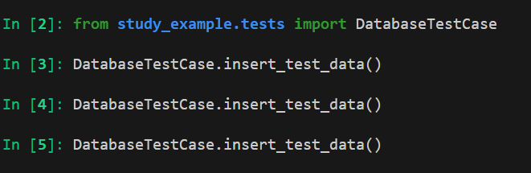

https://chatgpt.com/c/67c70940-53d4-8007-b1f8-83ed2df3d3c1

### 1. 테스트 코드 작성후

def test_employee_filters(self):
    # Test salary range filters
    for grade in SalaryGrade.objects.all():
        employees_in_range = Employee.objects.filter(sal__gte=grade.losal, sal__lte=grade.hisal)
        self.assertTrue(employees_in_range.exists())
        # SQL: SELECT * FROM employee WHERE sal >= [losal] AND sal <= [hisal];

    # Test job filters
    jobs = ['CLERK', 'SALESMAN', 'MANAGER', 'ANALYST', 'PRESIDENT']
    for job in jobs:
        employees_with_job = Employee.objects.filter(job=job)
        self.assertTrue(employees_with_job.exists())
        # SQL: SELECT * FROM employee WHERE job = '[job]';

    # Test department filters
    for dept in Department.objects.all():
        employees_in_dept = Employee.objects.filter(deptno_id=dept.deptno)
        self.assertTrue(employees_in_dept.exists())
        # SQL: SELECT * FROM employee WHERE deptno = [deptno_id];

    # Test hire date filters
    hire_dates = [
        datetime(1980, 1, 1), datetime(1981, 1, 1), datetime(1987, 1, 1),
        datetime(1985, 7, 1), datetime(1981, 12, 1)
    ]
    for date in hire_dates:
        employees_hired_after = Employee.objects.filter(hiredate__gte=date)
        self.assertTrue(employees_hired_after.exists())
        # SQL: SELECT * FROM employee WHERE hiredate >= '[date]';

    # Test salary filters (specific ranges)
    salary_ranges = [
        (800, 1000), (1000, 2000), (2000, 3000), (3000, 5000), (5000, 10000)
    ]
    for low, high in salary_ranges:
        employees_with_salary = Employee.objects.filter(sal__gte=low, sal__lte=high)
        self.assertTrue(employees_with_salary.exists())
        # SQL: SELECT * FROM employee WHERE sal >= [low] AND sal <= [high];

    # Test employee filters for specific names
    employee_names = ['SMITH', 'ALLEN', 'WARD', 'JONES', 'MARTIN']
    for name in employee_names:
        employee = Employee.objects.filter(ename=name)
        self.assertTrue(employee.exists())
        # SQL: SELECT * FROM employee WHERE ename = '[name]';

    # Test manager filter
    manager_ids = [7839, 7698, 7782]
    for mgr_id in manager_ids:
        employees_with_mgr = Employee.objects.filter(mgr_id=mgr_id)
        self.assertTrue(employees_with_mgr.exists())
        # SQL: SELECT * FROM employee WHERE mgr_id = [mgr_id];

    # Test employees with no manager
    employees_no_mgr = Employee.objects.filter(mgr_id__isnull=True)
    self.assertTrue(employees_no_mgr.exists())
    # SQL: SELECT * FROM employee WHERE mgr_id IS NULL;

    # Test employees with commission
    employees_with_comm = Employee.objects.filter(comm__isnull=False)
    self.assertTrue(employees_with_comm.exists())
    # SQL: SELECT * FROM employee WHERE comm IS NOT NULL;

    # Test employees with no commission
    employees_no_comm = Employee.objects.filter(comm__isnull=True)
    self.assertTrue(employees_no_comm.exists())
    # SQL: SELECT * FROM employee WHERE comm IS NULL;

    # Test employees with specific salary range using `gt` and `lt`
    employees_salary_above_2000 = Employee.objects.filter(sal__gt=2000)
    self.assertTrue(employees_salary_above_2000.exists())
    # SQL: SELECT * FROM employee WHERE sal > 2000;

    employees_salary_below_2000 = Employee.objects.filter(sal__lt=2000)
    self.assertTrue(employees_salary_below_2000.exists())
    # SQL: SELECT * FROM employee WHERE sal < 2000;

    # Test employees based on different combinations of filters
    for dept in Department.objects.all():
        for job in jobs:
            for grade in SalaryGrade.objects.all():
                employees_combined_filter = Employee.objects.filter(
                    deptno_id=dept.deptno, job=job, sal__gte=grade.losal, sal__lte=grade.hisal)
                self.assertTrue(employees_combined_filter.exists())
                # SQL: SELECT * FROM employee WHERE deptno = [deptno_id] AND job = '[job]' AND sal >= [losal] AND sal <= [hisal];

    # Test filters on combinations of commission and job titles
    for comm in [None, 0, 300, 1400]:
        for job in jobs:
            employees_combined_comm_job = Employee.objects.filter(comm=comm, job=job)
            self.assertTrue(employees_combined_comm_job.exists())
            # SQL: SELECT * FROM employee WHERE comm = [comm_value] AND job = '[job]';

    # Test filters on combinations of job titles and salary ranges
    for job in jobs:
        for low, high in salary_ranges:
            employees_combined_job_salary = Employee.objects.filter(
                job=job, sal__gte=low, sal__lte=high)
            self.assertTrue(employees_combined_job_salary.exists())
            # SQL: SELECT * FROM employee WHERE job = '[job]' AND sal >= [low] AND sal <= [high];

    # Test filters on employee names with department filter
    for dept in Department.objects.all():
        for name in employee_names:
            employees_with_name_in_dept = Employee.objects.filter(
                ename=name, deptno_id=dept.deptno)
            self.assertTrue(employees_with_name_in_dept.exists())
            # SQL: SELECT * FROM employee WHERE ename = '[name]' AND deptno = [deptno_id];

    # Test employee filter with multiple attributes
    for dept in Department.objects.all():
        for job in jobs:
            for name in employee_names:
                employees_combined_filter_2 = Employee.objects.filter(
                    deptno_id=dept.deptno, job=job, ename=name)
                self.assertTrue(employees_combined_filter_2.exists())
                # SQL: SELECT * FROM employee WHERE deptno = [deptno_id] AND job = '[job]' AND ename = '[name]';

    # Test filter on employees hired in specific years
    for year in [1980, 1981, 1987]:
        employees_hired_in_year = Employee.objects.filter(hiredate__year=year)
        self.assertTrue(employees_hired_in_year.exists())
        # SQL: SELECT * FROM employee WHERE YEAR(hiredate) = [year];

    # Test employees who were hired after a specific date
    specific_dates = [
        datetime(1981, 1, 1), datetime(1985, 7, 1), datetime(1987, 1, 1)
    ]
    for date in specific_dates:
        employees_hired_after_specific_date = Employee.objects.filter(hiredate__gt=date)
        self.assertTrue(employees_hired_after_specific_date.exists())
        # SQL: SELECT * FROM employee WHERE hiredate > '[specific_date]';

    # Test employees who were hired before a specific date
    for date in specific_dates:
        employees_hired_before_specific_date = Employee.objects.filter(hiredate__lt=date)
        self.assertTrue(employees_hired_before_specific_date.exists())
        # SQL: SELECT * FROM employee WHERE hiredate < '[specific_date]';

    # Test multiple job filters with commission and salary filters
    for job in jobs:
        for comm_value in [None, 0, 300, 500]:
            for low, high in salary_ranges:
                employees_with_multiple_filters = Employee.objects.filter(
                    job=job, comm=comm_value, sal__gte=low, sal__lte=high)
                self.assertTrue(employees_with_multiple_filters.exists())
                # SQL: SELECT * FROM employee WHERE job = '[job]' AND comm = [comm_value] AND sal >= [low] AND sal <= [high];