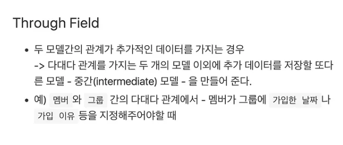

https://velog.io/@calzone0404/%ED%95%99%EC%8A%B5-%EC%A0%95%EB%A6%AC-Chapter-2.-%EB%AA%A8%EB%8D%B8%EB%A7%81%EA%B3%BC-%EB%A7%88%EC%9D%B4%EA%B7%B8%EB%A0%88%EC%9D%B4%EC%85%98-t28tx7xl

### 1. 모델관 맵핑

#### 1:1 1:N M:N

### 2. OneToOne(1:1 관계 매핑)

class Locker(models.Model):
student = models.OneToOneField(
to="Student",
null=True,
on_delete=models.SET_NULL,
)

1명의 직원은 1개의 주차 공간을 배정받을 수 있음

class Parkinglot(models.Model):
employee = models.OneToOneField(
to="Employee",
null=True,
on_delete=models.SET_NULL,
)

1개의 상점은 1개의 상점 정보 테이블을 가짐
class Store(models.Model):
store_info = models.OneToOneField(
to="StoreInfo",
null=True,
on_delete=models.CASCADE,
)

### 3. ManyToMany(M:N 관계 매핑)

class Product(models.Model):
name = models.CharField(max_length='128', help_text="product name")

    class Meta:
    	db_table = 'product'

# M:N관계는 주로 중간 테이블을 하나 만들어서 구성한다

class OrderedProduct(models.Model):
order = models.ForeignKey(
to='Order',
on_delete=models.CASCADE
)
product = models.ForeignKey(
to='Product',
on_delete=models.CASCADE,
)
count = models.IntegerField(help_text='ordered_product_cnt', default=1)

    class Meta:
    	db_table = 'ordered_product'

class Order(models.Model):
name = models.CharField(max_length='128', help_text="order name")
product_set = models.ManyToManyField(
to='Product',
through='OrderedProduct'
)

    class Meta:
    	# Database의 order by 문법에 의해 order가 키워드로 이미 지정되어 있다. 따라서 orderz처럼 테이블명을 정하는것임
        # 비슷한 사례로 class 대신 clazz로 이름을 사용하는것도 있음
    	db_table = 'orderz'

      

https://velog.io/@sangwoong/Python-6.5-Django-Tutorial-CRUDMtoM

예제 실습

```
# Create your models here.

class Movie(models.Model) :
  title             = models.CharField(max_length=45)
  release_date      = models.DateField()
  running_time_min  = models.IntegerField(null=True)
  actors            = models.ManyToManyField("Actor", db_table="movie_actor" through=movie_actor)
  # 영화가 배우를 정참조 ↔ 배우는 영화를 역참조(_set)
  # through를 통해 DB내에 자동으로 생성되는 movie_actor 테이블 생성

  class Meta:
    db_table = "movies"

class Actor(models.Model) :
  first_name    = models.CharField(max_length=45)
  last_name     = models.CharField(max_length=45)
  date_of_birth = models.DateField()

  class Meta :
    db_table = "actors"
```

ManyToManyField - Shell을 이용한 데이터 생성

python manage.py shell

from study_example.models import Actor, Movie
Movie.objects.create(title="범죄도시2", release_date="2022-05-18", running_time_min=106)
Movie.objects.create(title="범죄도시1", release_date="2017-10-03", running_time_min=121)

Actor.objects.create(last_name="마", first_name="동석", date_of_birth="1973-03-01")
Actor.objects.create(last_name="김", first_name="상웅", date_of_birth="1996-12-06")

두개의 테이블을 연결
Movie.objects.get(id=1).actors.add(Actor.objects.get(id=1))
Movie.objects.get(id=2).actors.add(Actor.objects.get(id=2))

제거

Movie.objects.get(id=2).actors.remove(Actor.objects.get(id=2))

#반대로 역방향 참조

Actor.objects.get(id = 1).movie_set.add(Movie.objects.get(id=2))

# 전체 제거

# 정참조의 경우

Movie.objects.get(id = 1).actors.clear()

# 역참조의 경우

Actor.objects.get(id = 1).movie_set.clear()
